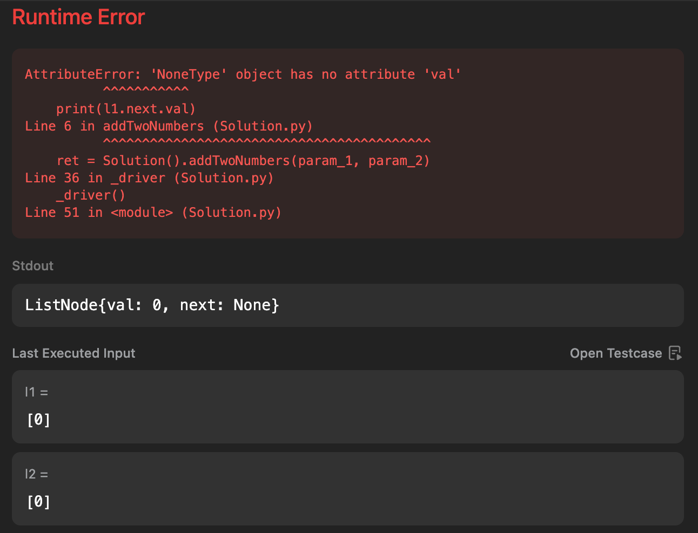

# note

## Python `typing.Optional` Notes
### Definition
`Optional[X]` is equivalent to `X | None` (or `Union[X, None]`).

### Key Points:
- **Not the same as an optional argument**: 
  - An **optional argument** is one that has a default value, and it does not require the use of `Optional` in the type annotation.
  - Example:
    ```python
    def foo(arg: int = 0) -> None:
        ...
    ```
- **When to use `Optional`**: 
  - Use `Optional` when an explicit value of `None` is allowed in the argument, regardless of whether it's optional or not.
  - Example:
    ```python
    def foo(arg: Optional[int] = None) -> None:
        ...
    ```

### Python 3.10 and Later
- Starting from Python 3.10, you can use the new `X | None` syntax as an alternative to `Optional[X]`.
  ```python
  def foo(arg: int | None = None) -> None:
      ...

### References
- [Python Official Documentation: `typing.Optional`](https://docs.python.org/3.13/library/typing.html)

---

---

## ListNode Class Definition

```python
class ListNode:
    def __init__(self, val: int = 0, next: 'Optional[ListNode]' = None):
        self.val = val
        self.next = next
```

### Example Usage

For example, when I ran `print(l1)`, the output was:

```python
ListNode{val: 2, next: ListNode{val: 4, next: ListNode{val: 3, next: None}}}
```

### Error Encountered

When I attempted `print(l1.next.val)`, I received the following error:

```command
AttributeError: 'NoneType' object has no attribute 'val'
          ^^^^^^^^^^^
    print(l1.next.val)
Line 6 in addTwoNumbers (Solution.py)
          ^^^^^^^^^^^^^^^^^^^^^^^^^^^^^^^^^^^^^^^^^^
    ret = Solution().addTwoNumbers(param_1, param_2)
Line 36 in _driver (Solution.py)
    _driver()
Line 51 in <module> (Solution.py)
```

### Visual Representation of the Error

Below is an image showing the error context:



### Explanation

The input is `l1 = ListNode(0)` and `l2 = ListNode(0)`.

---

## Safe Extraction of Node Values with Default Zero

```python
l1_val = l1.val if l1 else 0
l2_val = l2.val if l2 else 0
```

- **`l1.val if l1 else 0`**  
  - If `l1` is not `None`, use `l1.val`.  
  - Otherwise (when `l1` has reached the end of the list), substitute `0`.

- **`l2.val if l2 else 0`**  
  - Works the same way for `l2`.

> In the context of adding two numbers represented as linked lists of potentially different lengths, this pattern ensures any “missing” digits—when one list runs out before the other—are treated as zero, allowing the digit-by-digit addition (including any carry) to proceed uniformly.
